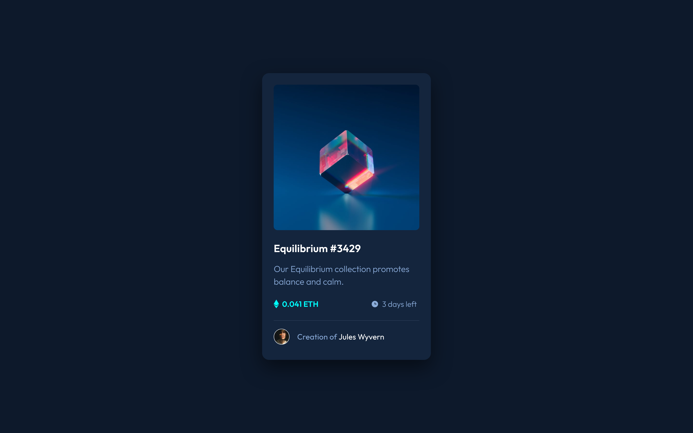

# Frontend Mentor - NFT preview card component solution

This is a solution to the [NFT preview card component challenge on Frontend Mentor](https://www.frontendmentor.io/challenges/nft-preview-card-component-SbdUL_w0U). Frontend Mentor challenges help you improve your coding skills by building realistic projects. 

## Table of contents

- [Overview](#overview)
  - [The challenge](#the-challenge)
  - [Screenshot](#screenshot)
  - [Links](#links)
- [My process](#my-process)
  - [Built with](#built-with)
  - [What I learned](#what-i-learned)
  - [Continued development](#continued-development)
  - [Useful resources](#useful-resources)
- [Author](#author)
- [Acknowledgments](#acknowledgments)

**Note: Delete this note and update the table of contents based on what sections you keep.**

## Overview

### The challenge

Users should be able to:

- View the optimal layout depending on their device's screen size
- See hover states for interactive elements

### Screenshot

### Links

- GitHub Repo: [https://github.com/IamAbhiDev/nft-preview-card-component-main.github.io](https://github.com/IamAbhiDev/nft-preview-card-component-main.github.io)
- Live Site URL: [https://iamabhidev.github.io/nft-preview-card-component-main.github.io](https://iamabhidev.github.io/nft-preview-card-component-main.github.io)

## My process

### Built with

- Semantic HTML5 markup
- CSS custom properties
- Flexbox
- Mobile-first workflow

### What I learned

Completing the NFT preview card component challenge on Frontend Mentor provided a valuable opportunity to refresh my CSS skills. While the challenge was centered around a basic and static HTML-CSS layout with or without responsive design, I was able to reinforce my ability to style elements using CSS properties effectively. I refreshed my understanding of concepts such as selectors, positioning, and the box model. Additionally, I practiced using version control with Git to track my changes throughout the project. This challenge was an excellent way to solidify my foundational CSS knowledge.Completing the QR code component challenge on Frontend Mentor provided a valuable opportunity to refresh my CSS skills. While the challenge was centered around a basic and static HTML-CSS layout without responsive design, I was able to reinforce my ability to style elements using CSS properties effectively. I refreshed my understanding of concepts such as selectors, positioning, and the box model. Additionally, I practiced using version control with Git to track my changes throughout the project. This challenge was an excellent way to solidify my foundational CSS knowledge.

### Continued development

In the future, I'm looking forward to exploring advanced CSS techniques, including responsive design and animations. I also plan to incorporate JavaScript to enhance user interactions and add dynamic elements to my projects. This challenge has inspired me to continue developing my skills and creating more engaging web experiences.

### Useful resources

- [Accessibility Insights](https://accessibilityinsights.io) - This chrome extension allowed me to run automated checks to test the accessibility of my website. I found it to be really useful in identifying potential issues and ensuring that my website is easily accessible to all visitors.

## Author

- GitHub - [@IamAbhiDev](https://github.com/IamAbhiDev)
- Frontend Mentor - [@IamAbhiDev](https://www.frontendmentor.io/profile/IamAbhiDev)
- Twitter - [@IamAbhiDev](https://www.twitter.com/IamAbhiDev)

## Acknowledgments

I want to express my gratitude to [@nakoyawilson](https://github.com/nakoyawilson) for her insightful code, which proved to be a valuable resource during my frontend coding challenge. Her solution provided me with useful guidance on structuring elements and CSS, which proved to be immensely helpful as I refreshed my skills for the challenge.